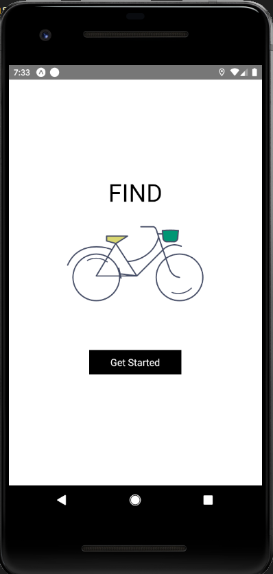

# skateparks-app

Find a skatepark near you !

# Todo

# Auth 

- [ ] Add users to map 
- [ ] Auth0 or mint token ?

# UI 

- [X] Remake Nav to look better
- [ ] Re-design Slider in radius page 
- [ ] Slider for radius in Setting page
- [ ] Add navigation transitions 
- [X] Style map 
- [X] Make marker icons and animations
- [X] Make center location icon

# Database 

- [X] Fix Size issue for photos 
- [C] Add multiple photos to skatepark
- [X] Connect auth and skatepark 
- [X] Resize images cloud function 
- [ ] Add end points for adding a skatepark 
- [ ] rating system 
- [ ] Cloud function for everything !!
- [X] daily nofication via cloud funtion

# Navigation

- [ ] Animations

# Other features 

- [ ] Search 
- [ ] Change location with drag 
- [ ] Add typescript dude
- [X] Dark mode never not dark mode

# Bugs 

- [ ] everything on ios ahahahahahha
- [ ] notifications on ios 
- [ ] firestore doc has changed issue
- [ ] backgorund Nofication bugs