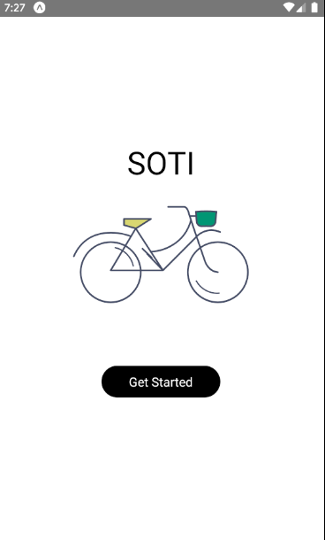
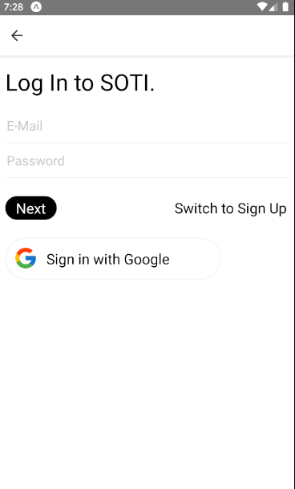
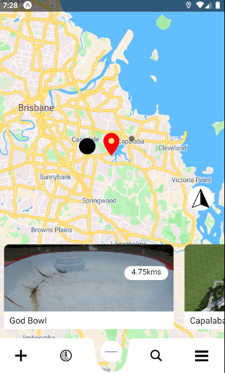
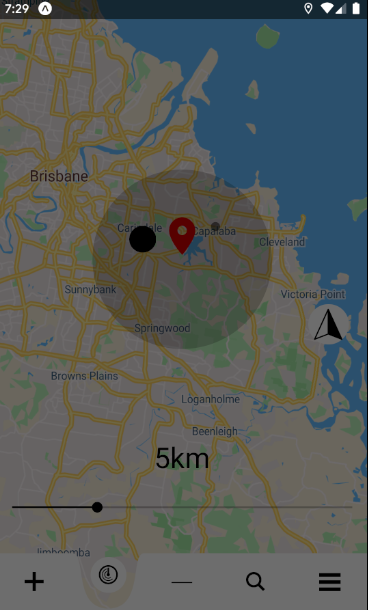
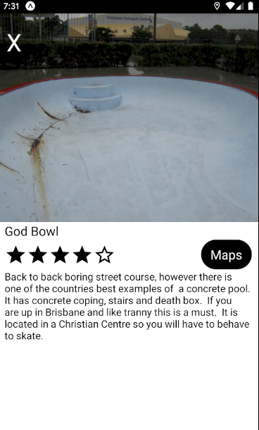
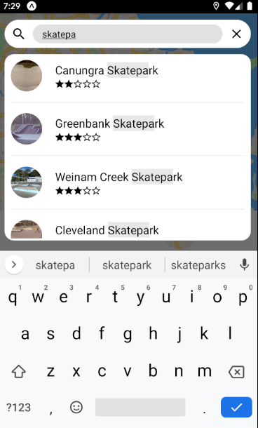
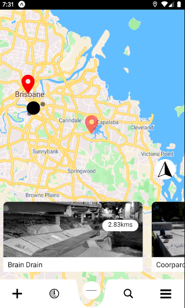
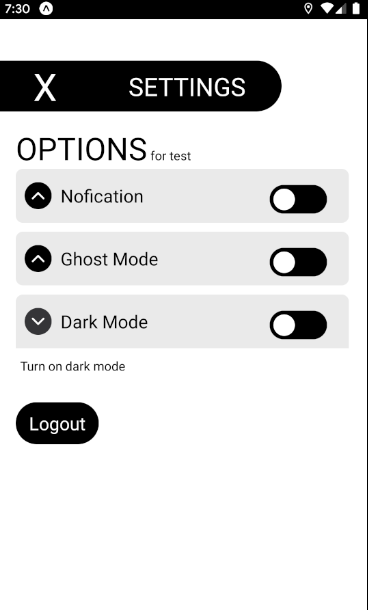
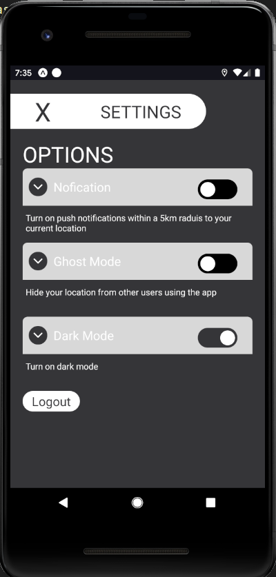

# skateparks-app

Find a skatepark near you !

# Todo

# Auth

- [x] Make admin accounts because my friends are assholes
- [ ] Add users to map
- [ ] Auth0 or mint token ?
- [ ] Fix Goggle auth and Apple

# UI

- [x] Remake Nav to look better
- [ ] Re-design Slider in radius page
- [ ] Slider for radius in Setting page
- [ ] Add navigation transitions
- [x] Style map
- [x] Make marker icons and animations
- [x] Make center location icon

# Database

- [x] Fix Size issue for photos
- [x] Add multiple photos to skatepark
- [x] Connect auth and skatepark
- [x] Resize images cloud function
- [X] Add end points for adding a skatepark
- [x] rating system
- [X] Cloud function for everything !!
- [x] daily nofication via cloud funtion
- [x] Admin accounts
- [X] Edit park images 

# Navigation

- [ ] Animations

# Other features

- [X] Search
- [x] Change location with drag
- [ ] Add typescript dude
- [x] Dark mode never not dark mode
- [ ] Rewrite Markers page with hooks 
- [ ] Center map when opening radius screen
 
# Bugs

- [ ] everything on ios ahahahahahha
- [ ] notifications on ios
- [x] firestore doc has changed issue
- [ ] backgorund Nofication bugs
